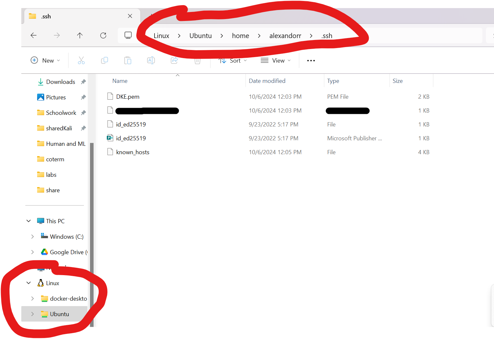

# Delta Kappa Epsilon Fraternity Website

  

_An RCOS project intended to create a website for Fraternities._

  

---

  

**Welcome to the open-source repository for the Psi Omega Chapter of Delta Kappa Epsilon (DKE) Fraternity website!** This project is dedicated to creating an interactive and informative website for our fraternity chapter, Delta Kappa Epsilon. Our primary goal is to provide a centralized platform for our members and potential recruits to access essential information, stay updated on events, and learn about our rich history.

  

## Features

  

- **Event Calendar**: Stay in the loop with our chapter's events and activities. Our event calendar will keep you informed about upcoming gatherings, parties, and community service initiatives.

  

- **Announcements**: Make announcements about important things that our chapter is doing  

  

- **Brother Roster**: Get to know our current brothers better with a comprehensive roster. Learn about their backgrounds, majors, and interests.

  

- **Chapter Information**: Discover more about our chapter, including our location, history, and notable awards and achievements.

  

- **Fraternity History**: Explore the rich history and traditions of the Delta Kappa Epsilon fraternity, both at the chapter level and within the national organization.

  

# Getting Started with Create React App

  

This project was bootstrapped with [Create React App](https://github.com/facebook/create-react-app).

  

## Available Scripts

  

In the project directory, you can run:

  

### `npm start`

  

Runs the app in the development mode.\

Open [http://localhost:3000](http://localhost:3000) to view it in your browser.

  

The page will reload when you make changes.\

You may also see any lint errors in the console.

  

### `npm test`

  

Launches the test runner in the interactive watch mode.\

See the section about [running tests](https://facebook.github.io/create-react-app/docs/running-tests) for more information.

  

### `npm run build`

  

Builds the app for production to the `build` folder.\

It correctly bundles React in production mode and optimizes the build for the best performance.

  

The build is minified and the filenames include the hashes.\

Your app is ready to be deployed!

  

See the section about [deployment](https://facebook.github.io/create-react-app/docs/deployment) for more information.

  

### `npm run eject`

  

**Note: this is a one-way operation. Once you `eject`, you can't go back!**

  

If you aren't satisfied with the build tool and configuration choices, you can `eject` at any time. This command will remove the single build dependency from your project.

  

Instead, it will copy all the configuration files and the transitive dependencies (webpack, Babel, ESLint, etc) right into your project so you have full control over them. All of the commands except `eject` will still work, but they will point to the copied scripts so you can tweak them. At this point you're on your own.

  

You don't have to ever use `eject`. The curated feature set is suitable for small and middle deployments, and you shouldn't feel obligated to use this feature. However we understand that this tool wouldn't be useful if you couldn't customize it when you are ready for it.

  

## Learn More

  

You can learn more in the [Create React App documentation](https://facebook.github.io/create-react-app/docs/getting-started).

  

To learn React, check out the [React documentation](https://reactjs.org/).

  

### Code Splitting

  

This section has moved here: [https://facebook.github.io/create-react-app/docs/code-splitting](https://facebook.github.io/create-react-app/docs/code-splitting)

  

### Analyzing the Bundle Size

  

This section has moved here: [https://facebook.github.io/create-react-app/docs/analyzing-the-bundle-size](https://facebook.github.io/create-react-app/docs/analyzing-the-bundle-size)

  

### Making a Progressive Web App

  

This section has moved here: [https://facebook.github.io/create-react-app/docs/making-a-progressive-web-app](https://facebook.github.io/create-react-app/docs/making-a-progressive-web-app)

  

### Advanced Configuration

  

This section has moved here: [https://facebook.github.io/create-react-app/docs/advanced-configuration](https://facebook.github.io/create-react-app/docs/advanced-configuration)

  

### Deployment

  

This section has moved here: [https://facebook.github.io/create-react-app/docs/deployment](https://facebook.github.io/create-react-app/docs/deployment)

  

### `npm run build` fails to minify

  

This section has moved here: [https://facebook.github.io/create-react-app/docs/troubleshooting#npm-run-build-fails-to-minify](https://facebook.github.io/create-react-app/docs/troubleshooting#npm-run-build-fails-to-minify)

# Connecting to the Server

## Quick Start Guide
Note: This guide assumes that you are on Windows using WSL. If you are on a different operating system, just be aware of where you download the DKE.pem key. The other steps should be the same.

1) Download the DKE.pem key
2) Move the key to your WSL's .ssh folder as shown in the screenshot. 
3) In your WSL/Linux terminal, run `chmod 600 ~/.ssh/DKE.pem`
4) You can now use `ssh -i ~/.ssh/DKE.pem ubuntu@PUBLIC_DNS` to connect to the server. 

For future connections, you only need to run the SSH command in the last step to connect.

## EC2 instance details
Specs:
core: t3.micro

# Understanding the Backend

## What to know as a Frontend Dev

If you want to understand the backend as a frontend developer, you came here for one of two things:
1) you want to know how to "refresh" the website to show your latest additions
2) the website is down and you want it back up

To refresh the website, connect to the server, then run `./restart.sh`. It takes awhile, sorry.

If the website is down, go to the Psi-Omega-Site directory and run `./startup.sh`
## What to know as a Backend Dev

### The Setup
Docker is used to locally host the website and a psql database. From there, nginx and certbot are used right on the server to reverse proxy the website out to the rest of the world. This is why if you do `docker ps -a` you will see a container for the website and the database but not nginx or certbot.

There's already a cronjob to have certbot automatically renew the SSL certificates for the website to be on HTTPS.

### Monitoring the AWS Instance
Occasionally, the server will go down. It is important to do regular checks on the instance through the AWS console to make sure it passes all the security checks and has no alarms.
If there are any failures or alarms, shut the server down and start it again. This will take a moment, but this should reset all the connections and allow access.
  
